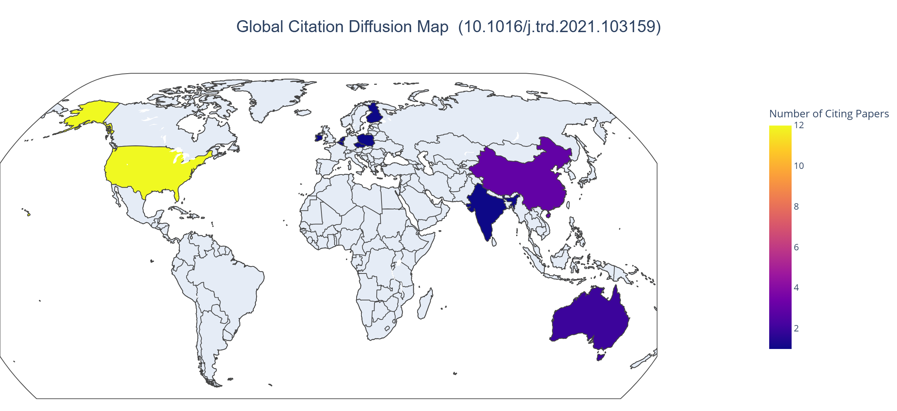
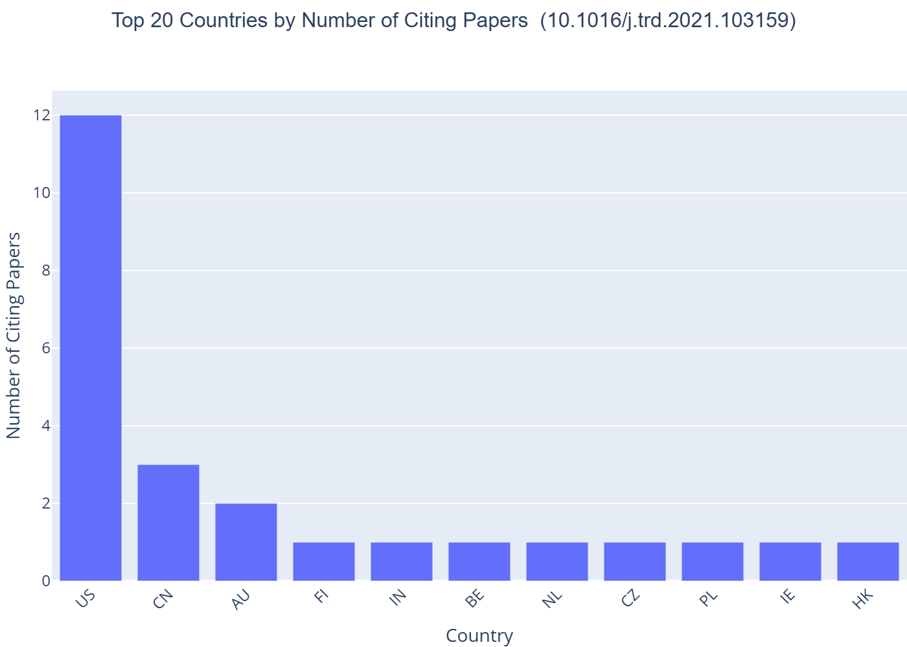
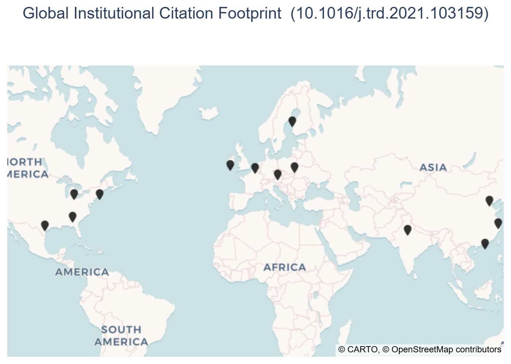

# Citation Map Generator
A reusable Python module for analyzing and generating citation networks using the OpenAlex API.
This tool enables users to generate forward citation maps, country-level distribution analyses, and interactive visualizations from any academic DOI. 

## Features

- 🔍 **Fetch citing works** from OpenAlex API with robust retry logic
- 🗺️ **Geographic analysis** - Extract country codes from author institutions
- 📊 **Interactive visualizations** - Choropleth maps and bar charts (HTML)
- 📁 **Intermediate outputs** - Export CSV files for custom analysis
- 🔄 **Batch processing** - Analyze multiple papers efficiently
- ⚙️ **Production-ready** - Proper error handling and logging

## Installation

### Requirements

- Python 3.7+
- OpenAlex API key (get one at: https://docs.openalex.org)

### Dependencies

```bash
pip install requests pandas plotly pycountry
```

## Quick Start

### 1. Simplest Usage

```python
from citation_map_generator import generate_citation_map

results = generate_citation_map(
    api_key="your_openalex_api_key",
    doi="your_paper_doi", # exclude https://doi.org/ part
    output_dir="your_output_directory"
)

print(f"Map HTML: {results['map_html']}")
print(f"Bar chart HTML: {results['bar_html']}")
```

### 2. Command Line

```bash
python citation_map_generator.py "your_api_key" "your_paper_doi" "your_output_directory"
```

### 3. Detailed Usage (with CSV generation)

```python
from citation_map_generator import CitationMapGenerator

generator = CitationMapGenerator(api_key="your_api_key")

# Step 1: Generate intermediate CSVs
csv_paths = generator.generate_csvs(
    doi="your_paper_doi",
    output_dir="your_output_directory"
)

# Step 2: Analyze or process the CSVs as needed
# ... your custom analysis here ...

# Step 3: Generate visualizations
html_paths = generator.generate_html_visualizations(
    country_csv=csv_paths["country_counts"],
    output_dir="your_output_directory"
)
```

## Output Files

### CSV Files

Generated by `generate_csvs()`:

- **citing_works.csv** - All papers citing your target paper
  - Columns: citing_openalex_id, citing_title, citing_year, citing_doi, citing_venue, cited_by_count, country_codes

- **country_counts.csv** - Citation counts by country
  - Columns: country_code, num_citing_papers

- **edges.csv** - Network edges (target → citing works)
  - Columns: source, target, type

- **nodes.csv** - Network nodes (all papers)
  - Columns: id, label, year, country_codes

### HTML Files

Generated by `generate_html_visualizations()`:

- **citation_country_map.html** - Interactive World map (choropleth)
- **citation_country_bar.html** - Top 20 countries bar chart

## 📊 Example Output

After running the script with a target DOI, the module generates:

- 🌍 Country-level citation distribution map
- 📈 Country citation bar chart
- 📍 Institution-level geographic pin map
- 📄 Exportable CSV files for further analysis

### 🌍 Country-Level Citation Map



### 📈 Country Distribution (Bar Chart)



### 📍 Institution-Level Citation Map



## API Reference
OpenAlex is a bibliographic catalogue of scientific papers, authors and institutions accessible in open access mode, named after the Library of Alexandria. It started operating in January 2022 by OurResearch as a successor of the terminated Microsoft Academic Graph. OpenAlex competes with commercial products such as Clarivate's Web of Science or Elsevier's Scopus, and is complemented by bibliometrics tools and an API.

## Performance Notes

- **API rate limiting**: Default is 100,000 requests/day for free tier. Providing `mailto` helps
- **Processing time**: ~1 second per citing paper (for country extraction)
- **Exponential backoff**: Automatically retries on rate limits (429) with smart backoff
- **CSV generation**: Takes longer than visualization generation
- **Recommendation**: Generate CSVs once, generate visualizations multiple times without re-fetching data

## Troubleshooting

### "Failed to fetch work for DOI"
- Check DOI format (should be like `10.1016/j.apenergy.2022.119295`)
- Verify the DOI exists on OpenAlex: https://openalex.org/search

### "429 - Too Many Requests"
- You're hitting rate limits. The script auto-retries, but consider:
  - Add `mailto` parameter when creating generator
  - Use a higher `max_retries` value
  - Run during off-peak hours

### "No countries could be mapped to ISO-3 codes"
- Some papers have incomplete institution data
- Consider using only high-quality data subset

### "No module named plotly" or "pycountry"
```bash
pip install -U plotly pycountry
```

## Extending the Module

### Add custom filters

```python
def get_citing_works_by_year(self, target_id: str, min_year: int):
    """Get citing works after a certain year."""
    params = {
        "filter": f"cites:{target_id},publication_year:>{min_year}",
        # ... rest of implementation
    }
```

### Add custom visualizations

```python
def generate_timeline(self, citing_df: pd.DataFrame):
    """Create publication year timeline."""
    import plotly.express as px
    fig = px.histogram(citing_df, x="citing_year", ...)
    fig.write_html("timeline.html")
```

## Citation

If you use this module in research, please consider citing:

```bibtex
@software{citation_map_generator,
  title={Citation Map Generator},
  author={Your Name},
  year={2026},
  url={https://github.com/yourusername/citation-map-generator}
}
```

## License

MIT

## Contributing

Contributions welcome! Please submit pull requests or open issues for bugs/features.

## Support

- OpenAlex API docs: https://docs.openalex.org
- Plotly visualization: https://plotly.com/python/
- Pycountry: https://pypi.org/project/pycountry/

## Acknowledgements and Thanks
This script was written with the assistance of ChatGPT-5.2.

Special thanks to @ChenLiu-1996 for developing the CitationMap project. While CitationMap provides valuable functionality, it relies on Google Scholar data extraction, which may encounter stability challenges due to CAPTCHA protections and automated request restrictions
